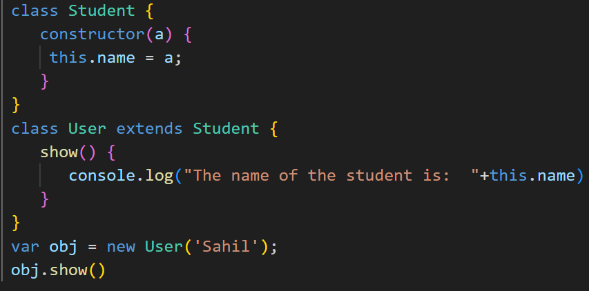

# Es6 Classes
Classes are essential p;arts in object orientend programming(oob)
classes are used to define the blueprint for real-world object modeling and organized code into reusable and logicaL parts.
A class defination can only incude constractors and functions. The classes contains constaructors that alocates thje memory to theobject of a class. Classescontain functions that are responsible for performing tha actions to the objects.

### Defining a class
To define a class in ES6, you use the class keyword followed by the class name

### Getters and Setters
You can define getter and setter methods in a class to control how properties are accessed or modified

### Class Expression
Classes can also be defined as expressions and assigned to variables

### The Static Keyword
The static keyword is used for making the static functions in the class. The static functions are refferenced only by using the className.

### Class Inheritance
Inheritance is the ability to create new entities from an existing ones.The class that is extended for creating newer classes is reffered to as **superclass/parent** class, while the newly created classes are called **subclass/Childclass**.   A class can be inherited from another class by using the **extends** keyword. except for the constractors from the parent class, child class inherites all properties and methods.  
  

**Types of Inheritance** 
1. single-level Inheritance
It is defined as the ingheritance in which a derived clas can only be inherited from only one base class. It allows a derived class to inherite the behavior and properties of a base class, which enables the reuserbility of code as well as adding the new features to the existing code. It makes the code less repetative.

2. Multiple Inheritance
In multiple inheritance a class can be inherited from several class. It is not supported in ES6.

3. Multi-level Inheritance
In multilevel inheritance, a derived class is created from another derived class.
Thus a multilevel inheritance has more than one parent class.

### The Super Keyword
It allows the child class to invoke the properties, methods and constractors of the emmediate parent class. 

